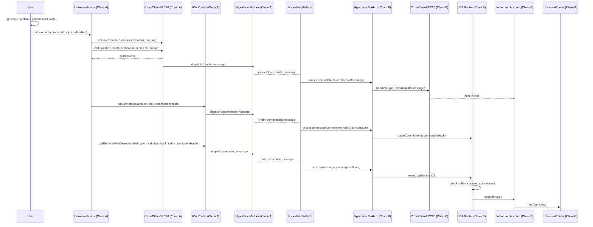

# Superswaps Feature Specification

## Glossary
- **Superchain**: A chain that is part of the Optimism interop set.
- **HypERC20**: Hyperlane's ERC20 token implementation.
- **SuperchainERC20**: A token that is compatible with the Superchain.
- **Cross chain asset**: Any asset that is supported cross chain (e.g. XVELO, HypERC20, or SuperchainERC20 compatible token).

## Overview

Superswaps is a cross-chain token swapping feature that enables users to swap tokens between different 
chains in a single transaction flow. It extends the existing Universal Router with cross chain functionality,
powered by Hyperlane.

## Features

In addition to all of the features the existing Universal Router supports, Superswaps is also capable of:
- Executing swaps against pools within the Velodrome ecosystem (i.e. pool2 and slipstream).
- Unwrapping WETH into ETH.
- Using regular approvals instead of permit2.
- Executing cross chain bridges on any XVELO or HypERC20 compatible tokens (such as openUSDT).
- Executing an onward swap on any chain that the Universal Router is deployed on.

The following features were removed:
- V3 / V4 NonfungiblePositionManager position migration
- V3 / V4 NonfungiblePositionManager multicall execution

## Technical Architecture

Superswaps will be implemented as a set of commands that extend the existing commands used to interact
with Uniswap and Velodrome pools.

### Command Structure

The Universal Router will now support the following new commands for Superswaps:

| Command | Description |
|---------|-------------|
| BRIDGE_TOKEN | Bridge XVELO or any HypERC20 token from source chain to destination chain |
| EXECUTE_CROSS_CHAIN | Execute commands on the destination chain |
| TRANSFER_FROM | Transfer a token from the user's wallet to another account |

### Command Encoding

For cross-chain swaps, proper command encoding is critical to ensure user funds are not stranded. 
Commands should be encoded as follows:

#### Origin Chain Commands
```solidity
// For simple cross-chain transfers
bytes memory commands = abi.encodePacked(
    bytes1(uint8(Commands.BRIDGE_TOKEN)),
    bytes1(uint8(Commands.EXECUTE_CROSS_CHAIN))
);

// Inputs for each command
bytes[] memory inputs = new bytes[](2);

// BRIDGE_TOKEN input parameters
inputs[0] = abi.encode(
    uint8(BridgeTypes.HYP_XERC20),  // Token bridge type
    recipientOnDestination,         // Recipient on destination chain
    sourceTokenAddress,             // Token address on source chain
    tokenBridgeAddress,             // Bridge contract address
    amountToBridge,                 // Amount to bridge
    destinationDomain,              // Domain ID of destination chain
    payerIsUser                     // Whether to use user as payer
);

// EXECUTE_CROSS_CHAIN input parameters
inputs[1] = abi.encode(
    destinationDomain,              // Destination chain domain
    originIcaRouterAddress,         // Interchain account router on source chain
    destinationIcaRouterAddress,    // Interchain account router on destination chain
    ismAddress,                     // Destination ISM (Interchain Security Module) address
    commitmentHash,                 // Hash commitment of destination chain calls
    postDispatchHook,               // Post dispatch hook address
    hookMetadata                    // Hook metadata (if any)
);
```

#### Destination Chain Commands
On the destination chain, it's recommended to include both a swap attempt and a fallback transfer to
ensure funds can be recovered if the swap fails. This will also ensure that experience slippage will
have residual funds sent to the recipient as well.

```solidity
// Primary operation (swap)
bytes memory swapSubplan = abi.encodePacked(bytes1(uint8(Commands.V3_SWAP_EXACT_IN)));
bytes[] memory swapInputs = new bytes[](1);
swapInputs[0] = abi.encode(
    recipientAddress,               // Recipient of swapped tokens
    amountIn,                       // Amount to swap
    amountOutMin,                   // Minimum output amount
    swapPath,                       // Token path with pool fee / tickspacing
    payerIsUser,                    // Whether to use user as payer
    isUni                           // Whether to use UniV3 pool
);

// Fallback operation (token transfer if swap fails)
bytes memory transferSubplan = abi.encodePacked(bytes1(uint8(Commands.TRANSFER_FROM)));
bytes[] memory transferInputs = new bytes[](1);
transferInputs[0] = abi.encode(
    tokenAddress,                   // Token to transfer
    recipientAddress,               // Recipient address
    amount                          // Amount to transfer
);

// Combine operations with EXECUTE_SUB_PLAN
bytes memory destinationCommands = abi.encodePacked(
    bytes1(uint8(Commands.EXECUTE_SUB_PLAN)) | Commands.FLAG_ALLOW_REVERT,
    bytes1(uint8(Commands.EXECUTE_SUB_PLAN)) | Commands.FLAG_ALLOW_REVERT
);
bytes[] memory destinationInputs = new bytes[](2);
destinationInputs[0] = abi.encode(swapSubplan, swapInputs);
destinationInputs[1] = abi.encode(transferSubplan, transferInputs);
```

The `FLAG_ALLOW_REVERT` flag is crucial as it allows execution to continue even if a command fails, 
ensuring the fallback transfer can execute if the swap fails.

### Swap Types

In the simplest example, a user will be able to swap and optionally transfer a cross chain asset from chain A to some other chain B. This would involve a basic swap command on chain A, followed by a bridge command to chain B.

In the more complex example, a user will also be able to execute a swap command on the destination chain B. Given that swap parameters need to be private in order to prevent front-running, submarine sends are used. 

When the user wishes to execute a swap on the destination chain, the following will happen:
- The user's payload will include a `BRIDGE_TOKEN` command to bridge the tokens to swap to the destination chain. This can include tokens received from a previous swap on the source chain.
- The payload will also include a `EXECUTE_CROSS_CHAIN` command to execute the swap on the destination chain. 
- As part of the parameters passed to the `EXECUTE_CROSS_CHAIN` command, the user will submit a hash commitment of the calls intended to be executed on the destination chain (i.e. the destination payload).
- The user's funds are initially bridged to the destination chain, and will sit in a contract on the
destination chain associated with the superswaps router and the user. This contract (the interchain account) is 
controllable only by the user through the superswaps router.
- The destination payload is then submitted privately to a relayer, who will execute the payload on
the destination chain. The transaction is proxied through the user's interchain account.
- In the case of a succesful swap, the user's account approves the superswaps router to spend the tokens,
and then executes the swaps on the destination chain.
- If the swap fails for any reason, the user's funds will be forwarded to them on chain B.
- The user is able to self relay if the relayer fails to relay the transaction for any reason.

Note that superswaps is agnostic to the relaying mechanism. It can be done via Hyperlane or via the Superchain.

### Transfer Flow

The following diagram shows the transfer flow using Hyperlane rails. Hyperlane's interchain accounts
are used to segment user funds. 

